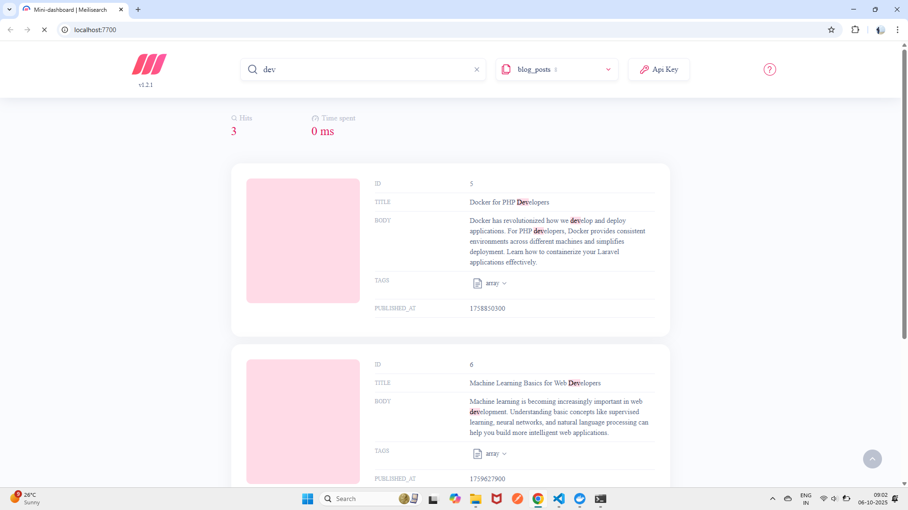

# 🚀 Laravel Docker Environment

This project runs a **Laravel 11** application inside Docker with **MySQL** and **Meilisearch** services.  
Follow the steps below to build and run the application locally.

---

## 🧱 Prerequisites

Before starting, make sure you have installed:

- [Docker Desktop](https://www.docker.com/products/docker-desktop)
- [Git](https://git-scm.com/downloads)

---

## 🧩 Project Setup

### 1️⃣ Clone the repository

```bash
git clone https://github.com/Manojk-1989/docker-machine-test.git
cd docker-machine-test

2️⃣ Build and start Docker containers
docker compose up -d --build

⚠️ You may see a warning about version being obsolete. This can be safely ignored.

3️⃣ Check running services
docker ps

Expected containers:
| Container     | Description         | Port |
| ------------- | ------------------- | ---- |
| `app`         | Laravel application | 8000 |
| `db`          | MySQL database      | 3307 |
| `meilisearch` | Search engine       | 7700 |

4️⃣ Install PHP dependencies via Composer
docker compose run --rm app composer install --no-interaction --prefer-dist

5️⃣ Create a .env file
docker exec -it my_app cp /var/www/html/.env.example /var/www/html/.env

6️⃣ Update database settings in .env
DB_CONNECTION=mysql
DB_HOST=db
DB_PORT=3306
DB_DATABASE=laravel
DB_USERNAME=root
DB_PASSWORD=

✅ Laravel Scout + Meilisearch Configuration
SCOUT_DRIVER=meilisearch
SCOUT_QUEUE=true
MEILISEARCH_HOST=http://meilisearch:7700
MEILISEARCH_KEY=masterKey

✅ Sanctum / Session Config
SANCTUM_STATEFUL_DOMAINS=localhost:8000
SESSION_DOMAIN=localhost

7️⃣ Generate the application key
docker exec -it my_app php artisan key:generate

8️⃣ Run database migrations
docker exec -it my_app php artisan migrate:fresh --seed

🌐 Access the application

Visit your Laravel app in the browser:

http://localhost:8000

Access the API documentation page:

http://localhost:8000/docs/api#/

1️⃣ Clear and cache Laravel config

Run inside your Laravel container:
docker exec -it my_app php artisan config:clear
docker exec -it my_app php artisan config:cache

This ensures Laravel picks up the MEILISEARCH_KEY.

2️⃣ Restart Meilisearch container (optional)
docker compose restart meilisearch

3️⃣ Test Meilisearch connection
docker exec -it my_app php artisan tinker
> config('scout.meilisearch.key');


9️⃣ Re-import your models
docker exec -it my_app php artisan scout:import "App\Models\Faq"
docker exec -it my_app php artisan scout:import "App\Models\Page"
docker exec -it my_app php artisan scout:import "App\Models\Product"
docker exec -it my_app php artisan scout:import "App\Models\BlogPost"

Then  Visit your Laravel app in the browser:
put api on masterkey and submit then you get below sc reen

http://localhost:7700/

